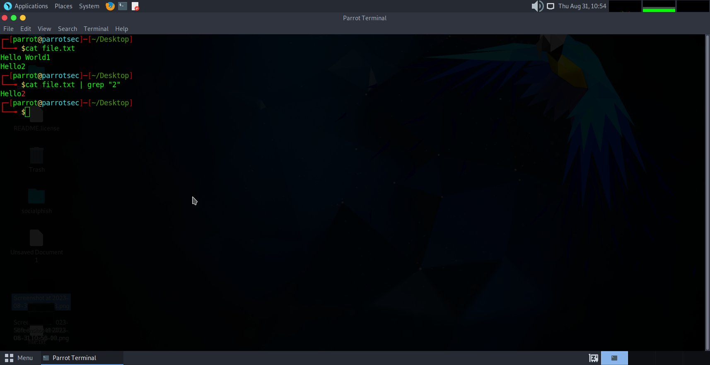
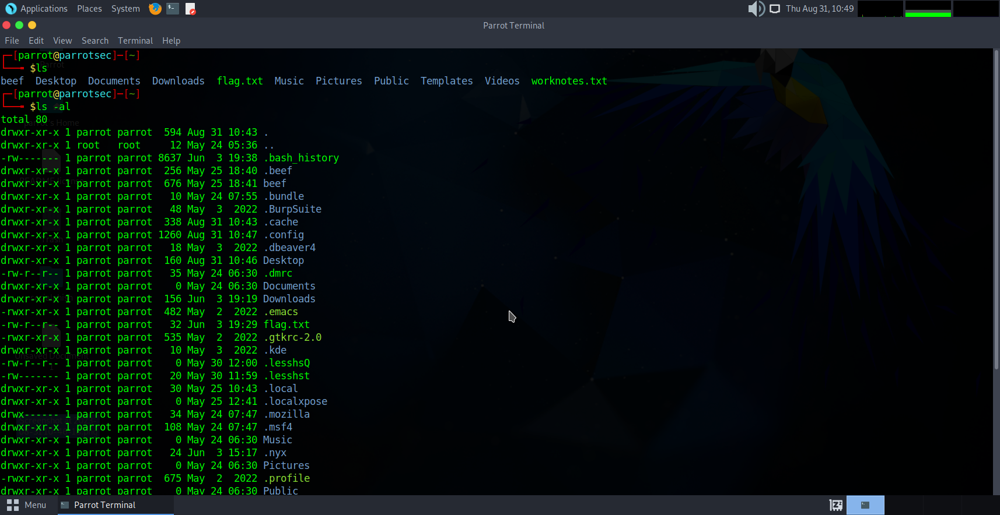
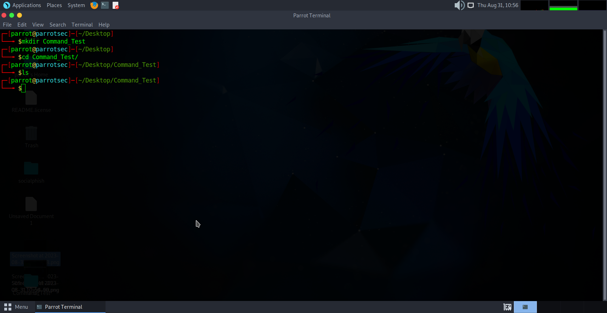
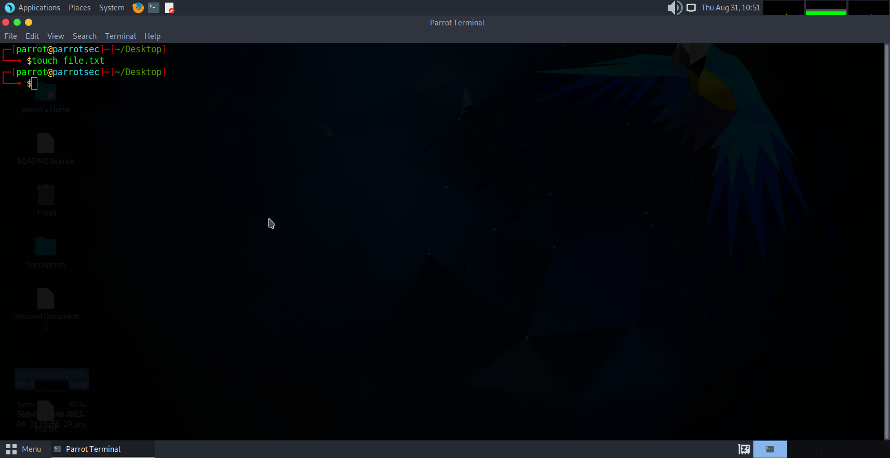
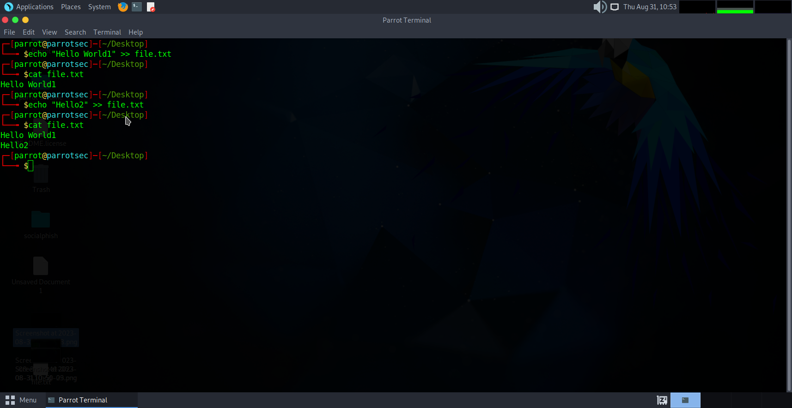
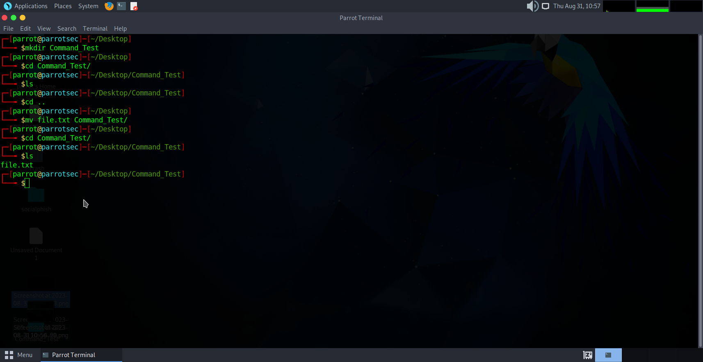
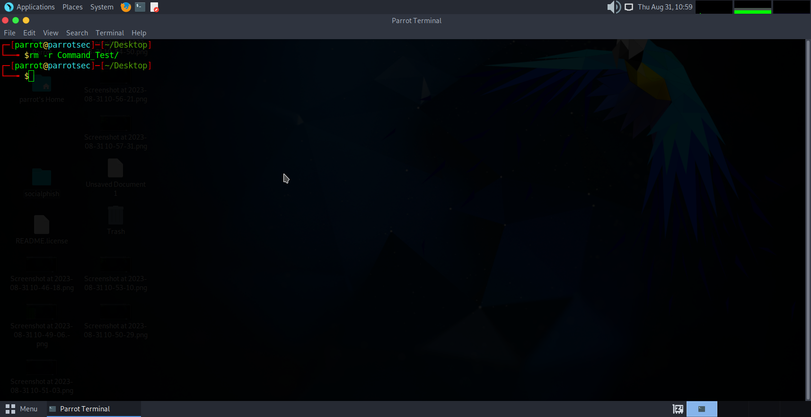
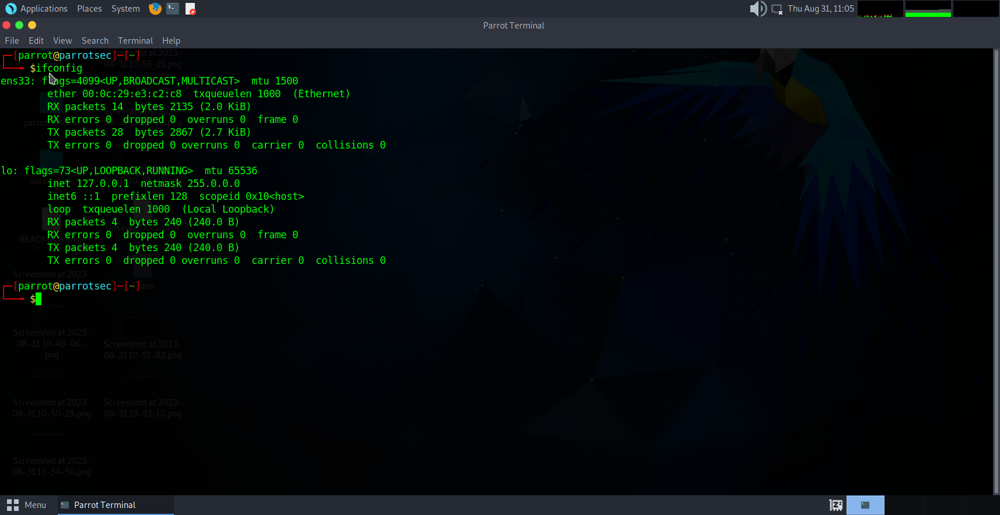

# Linux Commands
### pwd:
    The pwd command (print working directory) writes the full pathname of the current working directory to the standard output.

### ls:
    ls is a Linux shell command that lists directory contents of files and directories.  It provides valuable information about files, directories, and their attributes

### cd:
    The cd command, also known as (change directory), is a command-line shell command used to change the current working directory in various operating systems. It can be used in shell scripts and batch files.

### mkdir:
    The mkdir (make directory) command is used to make a new directory.

### touch:
    The touch command's primary function is to modify a timestamp. Commonly, the utility is used for file creation, although this is not its primary function. The terminal program can change the modification and access time for any given file. The touch command creates a file only if the file doesn't already exist.

### echo:
    The echo command in Linux is a built-in command that allows users to display lines of text or strings that are passed as arguments. It is commonly used in shell scripts and batch files to output status text to the screen or a file, it can print in files too.
### grep:
    The grep filter searches a file for a particular pattern of characters, and displays all lines that contain that pattern. The pattern that is searched in the file is referred to as the regular expression (grep stands for global search for regular expression and print out). 

### cat:
    Cat(concatenate) command is very frequently used in Linux. It reads data from the file and gives its content as output. It helps us to create, view, and concatenate files.

### mv:
    this command is used to rename file directories and move files from one location to another within a file system.

### rm:
    rm stands for remove here. rm command is used to remove objects such as files, directories, symbolic links and so on from the file system

### ifconfig:
    The ifconfig function displays the current configuration for a network interface
